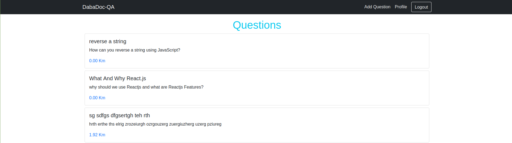
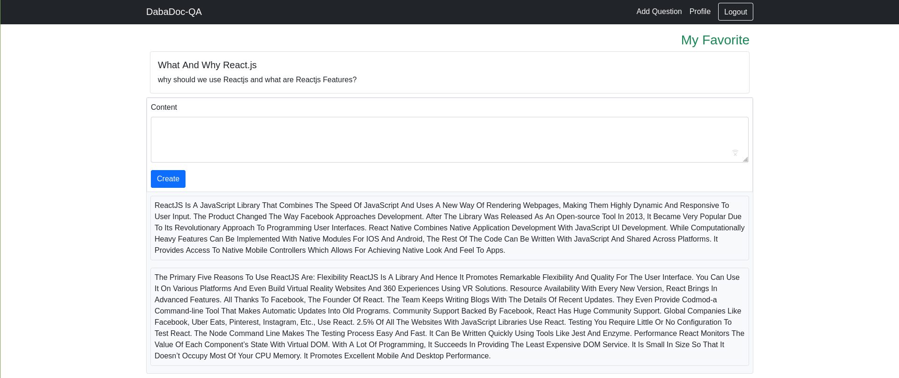

# DabaDOC-QA

This project is a React webapp that connected to a [back-end](https://github.com/rida-elbahtouri/DabaDoc-Test) rails app.
the App allow user to Login and sign up with his email and password ,
explore questions ordered by distance,answer question, and finaly ad question to favorites list.

### Future features

- Allow user too question on google map

### ScreenShot




## Built With

- React
- JSX
- CSS
- JavaScript
- VS Code
- NPM
- Axios

## Prerequisites

You must have a browser on your PC in order to use the application. [Click here](https://www.mozilla.org/en-US/firefox/new/) to download one.

you must have [NodeJS](https://nodejs.org/en/)

## Getting Started

1. clone the project

```bash
# Clone this repository
$ git https://github.com/rida-elbahtouri/DabaDoc-FrontEnd.git

# Go into the repository
$ cd DabaDoc-FrontEnd


```

**You can Install the dependencies with this commands**

```bash
$ npm install

```

### start the app

```bash
$ npm  start
 # and open the link provided
```

### Usage

##### Signup with an Email and Password

##### Click on Add Question to Create Question ,and Allow Location Access

##### Click on any question,and clikco n My favorite to ad it to your favorite list

##### Clikcon your profile to find a list of your favorites Questions

##### Click on Any Question on Home page to see the answes

##### write yor answers and click create to add your answer

##### Click on logout ,to logout

## Authors

👤 **Rida Elbahtouri**

- [Github](https://github.com/rida-elbahtouri)
- [Twitter](https://twitter.com/RElbahtouri)
- [Linkedin](https://www.linkedin.com/in/rida-elbahtouri/)

## 🤝 Contributing

Contributions, issues and feature requests are welcome!

Feel free to check the <a href="https://github.com/rida-elbahtouri/DabaDoc-FrontEnd/issues" target="_blank">issues page</a>.

## Show your support

Give a ⭐️ if you like this project!
